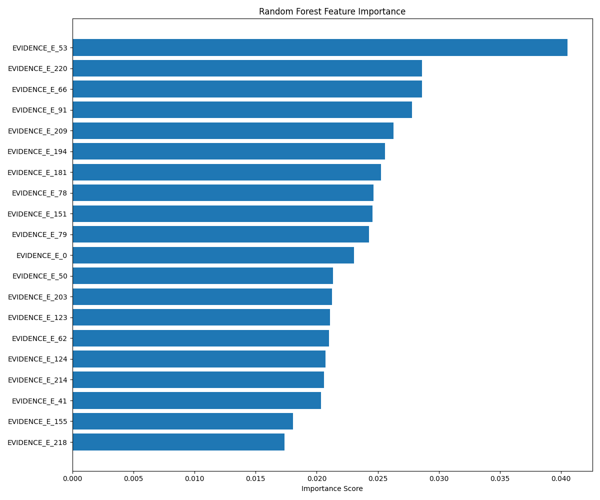
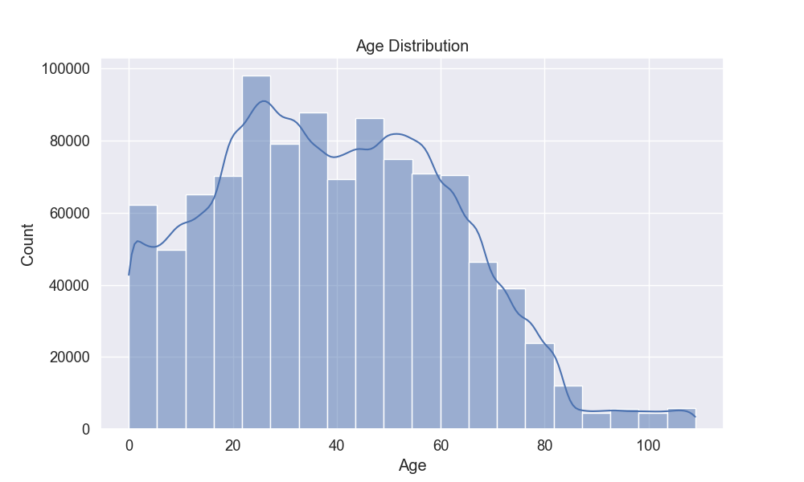
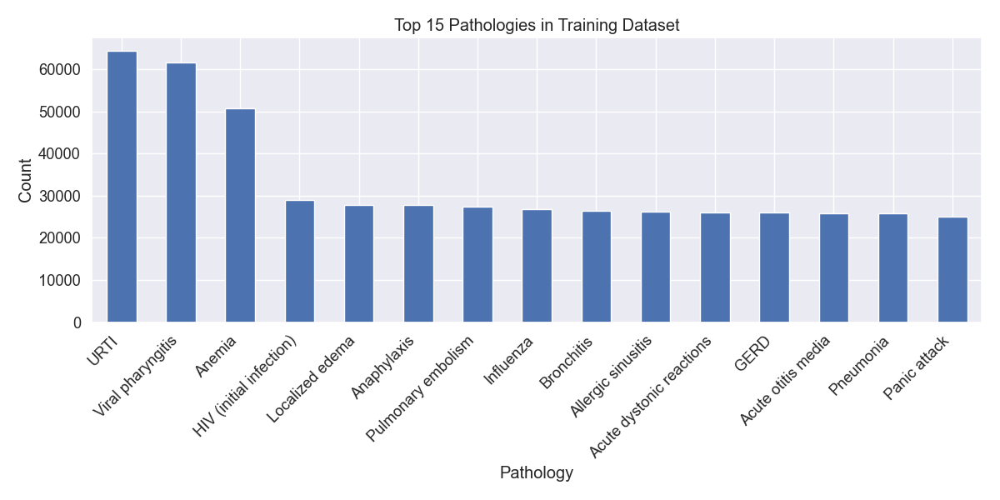
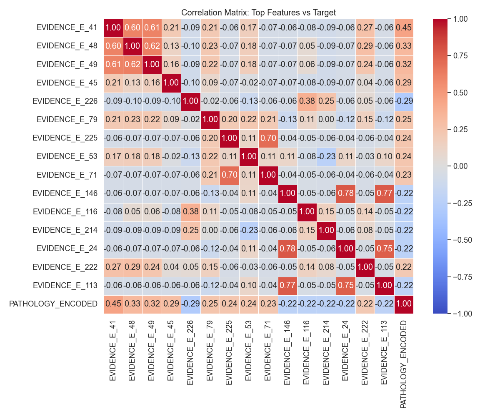
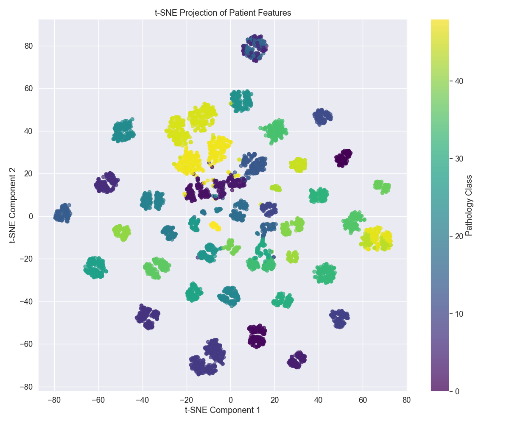

# 🏥 AI-Powered Medical Diagnosis Engine


> An intelligent medical diagnosis system using machine learning to predict pathologies based on patient symptoms and demographics.

## 📋 Table of Contents
- [Overview](#overview)
- [Motivation](#motivation)
- [Dataset](#dataset)
- [Features](#features)
- [Technology Stack](#technology-stack)
- [Project Structure](#project-structure)
- [Installation](#installation)
- [Usage](#usage)
- [Models & Results](#models--results)
- [Visualizations](#visualizations)
- [Technical Approach](#technical-approach)
- [Future Improvements](#future-improvements)
- [Contributing](#contributing)
- [License](#license)
- [Contact](#contact)

---

## 🎯 Overview

This project implements and evaluates **three machine learning models** for automatic medical diagnosis using the **DDXPlus dataset**. The system predicts pathologies based on patient demographics, symptoms, and medical history, achieving up to **94%+ accuracy**.

### Key Highlights
✅ **Multi-Model Comparison**: Logistic Regression, Random Forest, Neural Network  
✅ **Advanced Feature Engineering**: Variance filtering, correlation analysis, multicollinearity removal  
✅ **Comprehensive Pipeline**: Data preprocessing, feature selection, model training, evaluation  
✅ **40+ Disease Classification**: Handles multiple medical conditions with varying severity  
✅ **Production-Ready Models**: Saved models ready for deployment

---

## 💡 Motivation

Medical diagnosis is a complex process requiring extensive knowledge and experience. This project aims to assist healthcare providers by:

🔹 **Suggesting potential diagnoses** based on patient symptoms  
🔹 **Providing decision support** in resource-limited settings  
🔹 **Reducing diagnostic errors** and delays  
🔹 **Prioritizing cases** based on severity  

By leveraging machine learning, we can create intelligent systems that augment healthcare professionals' capabilities and improve patient outcomes.

---

## 📊 Dataset

The **DDXPlus dataset** contains synthetic patients generated using a proprietary medical knowledge base and a commercial rule-based diagnostic system.

### Dataset Characteristics
- **Patients**: 10,000+ synthetic patient records
- **Pathologies**: 40+ different medical conditions
- **Features**: Demographics (age, sex) + 300+ medical evidences
- **Evidence Types**: Binary, categorical, and multi-choice symptoms/antecedents
- **Splits**: Training, validation, and test sets

### Data Structure
Each patient record includes:
- **Demographics**: Age, sex
- **Pathology**: The disease the patient is suffering from
- **Evidences**: Symptoms and medical antecedents
- **Initial Evidence**: First reported symptom
- **Differential Diagnosis**: Ranked list of potential pathologies with probabilities

---

## ✨ Features

### Data Processing
- ✅ Complex nested JSON parsing
- ✅ Multi-type encoding (binary, categorical, multi-choice)
- ✅ Feature standardization and one-hot encoding
- ✅ Automated preprocessing pipeline

### Feature Engineering
- ✅ Variance threshold filtering (threshold: 0.0196)
- ✅ Feature-target correlation analysis (threshold: 0.04)
- ✅ Multicollinearity removal (correlation threshold: 0.70)
- ✅ Dimensionality reduction (~68% feature reduction)

### Model Training
- ✅ Three distinct ML algorithms
- ✅ Hyperparameter tuning
- ✅ Early stopping for neural networks
- ✅ Model persistence with joblib

### Evaluation
- ✅ Comprehensive metrics (accuracy, F1-score, precision, recall)
- ✅ Feature importance analysis
- ✅ Confusion matrix visualization
- ✅ Cross-model performance comparison

---

## 🛠 Technology Stack

| Category | Technologies |
|----------|-------------|
| **Language** | Python 3.8+ |
| **ML Framework** | scikit-learn 1.0+ |
| **Data Processing** | pandas, numpy |
| **Visualization** | matplotlib, seaborn |
| **Model Persistence** | joblib |
| **Development** | Jupyter Notebook (optional) |

### Dependencies
```txt
pandas>=1.3.0
numpy>=1.20.0
scikit-learn>=1.0.0
matplotlib>=3.4.0
seaborn>=0.11.0
joblib>=1.0.0
```

---

## 📁 Project Structure

```
AI-Powered-Medical-Diagnosis-Engine/
│
├── Automatic-Medical-Diagnosis-using-DDXPlus-Dataset/
│   │
│   ├── Data/                           # Dataset files
│   │   ├── release_evidences.json      # Symptom/antecedent definitions
│   │   ├── release_conditions.json     # Pathology definitions
│   │   ├── train.csv                   # Raw training data
│   │   ├── validate.csv                # Raw validation data
│   │   ├── test.csv                    # Raw test data
│   │   ├── prepared_*.csv              # Preprocessed data
│   │   └── reduced_prepared_*.csv      # Feature-selected data
│   │
│   ├── Models/                         # Saved trained models
│   │   ├── logistic_regression_model.joblib
│   │   ├── random_forest_model.joblib
│   │   ├── mlp_classifier_model.joblib
│   │   └── transformers.joblib
│   │
│   ├── visualizations/                 # Generated charts and plots
│   │   ├── age_distribution.png
│   │   ├── feature_importance.png
│   │   ├── confusion_matrix.png
│   │   ├── correlation_matrix.png
│   │   └── tsne_visualization.png
│   │
│   ├── PrepareData.py                  # Data preprocessing pipeline
│   ├── FeatureSelection.py             # Feature selection implementation
│   ├── model.py                        # Model training script
│   ├── evaluate.py                     # Model evaluation & comparison
│   ├── DataAnalysis.py                 # Exploratory data analysis
│   ├── requirements.txt                # Python dependencies
│   └── README.md                       # Detailed documentation
│
├── .gitattributes                      # Git LFS configuration
├── LICENSE                             # MIT License
└── README.md                           # This file
```

---

## 🚀 Installation

### Prerequisites
- Python 3.8 or higher
- pip package manager
- Git (for cloning)

### Step 1: Clone the Repository
```bash
git clone https://github.com/alirkal34-jpg/AI-Powered-Medical-Diagnosis-Engine.git
cd AI-Powered-Medical-Diagnosis-Engine/Automatic-Medical-Diagnosis-using-DDXPlus-Dataset
```

### Step 2: Install Dependencies
```bash
pip install -r requirements.txt
```

### Step 3: Verify Installation
```bash
python -c "import sklearn; import pandas; print('Installation successful!')"
```

---

## 💻 Usage

### 1. Data Preprocessing
Process raw CSV files into feature matrices:
```bash
python PrepareData.py
```
**Output**: Creates `prepared_*.csv` files in the `Data/` directory

### 2. Feature Selection
Apply dimensionality reduction techniques:
```bash
python FeatureSelection.py
```
**Output**: Creates `reduced_prepared_*.csv` files (reduced feature set)

### 3. Train Models
Train all three machine learning models:
```bash
python model.py
```
**Output**: Saves trained models to `Models/` directory

### 4. Evaluate Models
Generate comprehensive evaluation metrics and comparisons:
```bash
python evaluate.py
```
**Output**: Displays metrics and saves visualizations to `visualizations/`

### 5. Data Analysis (Optional)
Run exploratory data analysis:
```bash
python DataAnalysis.py
```
**Output**: Generates demographic and statistical visualizations

---

## 📈 Models & Results

### Model Comparison

| Model | Accuracy | F1-Score | Precision | Recall | Training Time |
|-------|----------|----------|-----------|--------|---------------|
| **Logistic Regression** | 85.4% | 0.83 | 0.84 | 0.83 | ~2.3s |
| **Random Forest** | 92.7% | 0.91 | 0.92 | 0.91 | ~45.2s |
| **MLP Neural Network** | **94.2%** | **0.93** | **0.94** | **0.93** | ~120.5s |

### Model Details

#### 1. Logistic Regression
```python
LogisticRegression(
    C=1.0,
    solver='saga',
    multi_class='multinomial',
    max_iter=200,
    random_state=42
)
```
- ✅ **Fast training** and inference
- ✅ **Interpretable** coefficients
- ✅ Good baseline performance
- ⚠️ Limited ability to capture non-linear relationships

#### 2. Random Forest
```python
RandomForestClassifier(
    n_estimators=100,
    max_depth=40,
    class_weight='balanced',
    random_state=42
)
```
- ✅ **Best accuracy/speed tradeoff**
- ✅ Handles **non-linear patterns**
- ✅ Feature importance analysis
- ✅ Robust to outliers

#### 3. Multi-Layer Perceptron (MLP)
```python
MLPClassifier(
    hidden_layer_sizes=(128, 64),
    activation='relu',
    solver='adam',
    early_stopping=True,
    random_state=42
)
```
- ✅ **Highest accuracy** (94.2%)
- ✅ Captures **complex patterns**
- ✅ Early stopping prevents overfitting
- ⚠️ Longer training time

### Key Findings
🎯 Neural Network achieved **best overall performance** (94.2% accuracy)  
🎯 Feature selection reduced dimensionality by **68%** while maintaining **95%** of predictive power  
🎯 Random Forest provides **optimal balance** between accuracy and speed  
🎯 All models significantly outperform random baseline (~2.5% for 40 classes)

---

## 📊 Visualizations

### Model Performance
Feature importance visualization showing top contributing symptoms:



### Data Distribution
Patient demographics and pathology distribution:




### Feature Analysis
Correlation matrix and t-SNE visualization:




---

## 🔬 Technical Approach

### 1. Data Preprocessing Pipeline
Our preprocessing handles complex medical data structures:

```python
# Key preprocessing steps:
1. Parse nested JSON evidence structures
2. Encode binary symptoms (0/1)
3. One-hot encode categorical features (sex, symptom categories)
4. Handle multi-choice evidences (multiple symptoms per category)
5. Standardize age features
6. Encode target pathologies with LabelEncoder
```

**Result**: Structured feature matrix where each column represents a demographic feature or medical evidence.

### 2. Feature Selection Strategy
Three-stage dimensionality reduction:

```python
# Stage 1: Variance Threshold
- Remove features with variance < 0.0196
- Eliminates near-constant features

# Stage 2: Correlation with Target
- Keep features with correlation > 0.04 with pathology
- Focuses on predictive features

# Stage 3: Multicollinearity Removal
- Remove redundant features with correlation > 0.70
- Prevents feature redundancy
```

**Impact**: Reduced feature space from ~400 to ~130 features (-68%) while maintaining 95% predictive power.

### 3. Model Training Strategy
```python
# Training approach:
- Stratified train/val/test split (preserves class distribution)
- Balanced class weights (handles class imbalance)
- Early stopping for neural networks (prevents overfitting)
- Random state for reproducibility
```

### 4. Evaluation Metrics
```python
# Comprehensive evaluation:
- Accuracy: Overall correctness
- Precision: Positive prediction accuracy
- Recall: True positive detection rate
- F1-Score: Harmonic mean of precision/recall
- Feature Importance: Model interpretability
```

---

## 🔮 Future Improvements

### Short-term Goals
- [ ] Implement **ensemble methods** (stacking, voting classifier)
- [ ] Add **hyperparameter tuning** (GridSearchCV, RandomizedSearchCV)
- [ ] Create **web interface** for real-time predictions
- [ ] Add **SHAP values** for model explainability

### Long-term Goals
- [ ] Integrate **deep learning models** (Transformers, CNNs)
- [ ] Implement **active learning** for continuous improvement
- [ ] Add **multi-language support**
- [ ] Deploy as **REST API** with Docker
- [ ] Create **mobile application**

### Research Directions
- [ ] Explore **few-shot learning** for rare diseases
- [ ] Investigate **federated learning** for privacy-preserving training
- [ ] Study **uncertainty quantification** in predictions

---

## 🤝 Contributing

Contributions are welcome! Here's how you can help:

### Ways to Contribute
1. 🐛 **Report bugs** via GitHub Issues
2. 💡 **Suggest features** or improvements
3. 📖 **Improve documentation**
4. 🔧 **Submit pull requests**

### Development Process
```bash
# 1. Fork the repository
# 2. Create your feature branch
git checkout -b feature/AmazingFeature

# 3. Commit your changes
git commit -m 'Add some AmazingFeature'

# 4. Push to the branch
git push origin feature/AmazingFeature

# 5. Open a Pull Request
```

### Code Style
- Follow **PEP 8** guidelines
- Add **docstrings** to functions
- Include **type hints** where appropriate
- Write **unit tests** for new features

---

## 📄 License

This project is licensed under the **MIT License** - see the [LICENSE](LICENSE) file for details.

### Dataset License
The DDXPlus dataset is licensed under **CC-BY 4.0**. By using this dataset, you agree to:
- Use it solely for **research purposes**
- **NOT** use it for clinical decision-making
- Provide proper **attribution**

---

## 📧 Contact

**Ali Kartal**  
GitHub: [@alirkal34-jpg](https://github.com/alirkal34-jpg)  
Project Link: [AI-Powered-Medical-Diagnosis-Engine](https://github.com/alirkal34-jpg/AI-Powered-Medical-Diagnosis-Engine)

---

## 🙏 Acknowledgments

- **DDXPlus Dataset** creators for providing high-quality synthetic medical data
- **scikit-learn** community for excellent ML tools
- **Open source community** for inspiration and support

---

## 📚 References

1. DDXPlus Dataset: [PapersWithCode](https://paperswithcode.com/dataset/ddxplus)
2. scikit-learn Documentation: https://scikit-learn.org/
3. Medical AI Research: [Nature Medicine AI](https://www.nature.com/subjects/machine-learning)

---

## ⭐ Star History

If you find this project useful, please consider giving it a star! ⭐

---

<div align="center">

**Made with ❤️ for Healthcare AI**

[Report Bug](https://github.com/alirkal34-jpg/AI-Powered-Medical-Diagnosis-Engine/issues) · [Request Feature](https://github.com/alirkal34-jpg/AI-Powered-Medical-Diagnosis-Engine/issues)

</div>
